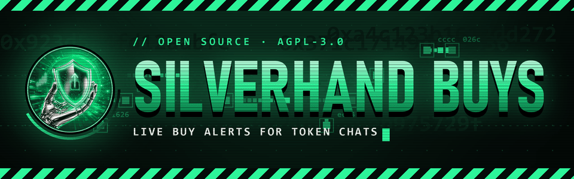
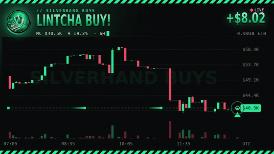
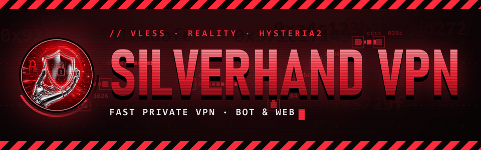
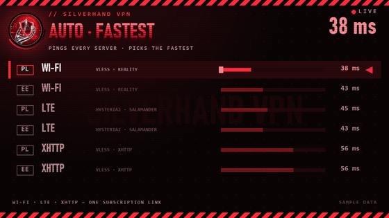

  

<h3 align="center">Live, on-chain tools for Telegram token communities on Robinhood Chain</h3>

  
  
  

---

### ⚡ [Silverhand Buys](https://github.com/Fiveloss/silverhand-buys)

A Telegram buy bot: add it to your token's group or channel and every buy lands in the chat the moment it hits the chain.

- 🎞 an animated market-cap card with every post
- 🆕 new holders, 💼 position changes, 🐋 whales, 👨‍💻 dev buys
- 🔴 sells too, if you want them
- 🚀 posts of their own for new market-cap highs and a filling curve
- 📊 `/stats` and 🏆 `/top` right in the chat
- 🌐 English and Русский · forum topics · channels
- 🔒 reads only its own commands, never asks for keys

**[➕ Add to your chat](https://t.me/SilverhandBuysBot)** · **[📖 Source](https://github.com/Fiveloss/silverhand-buys)**

 

---

  

  
  

### 🔴 [Silverhand VPN](https://quaynet.online)

A paid VPN you buy and manage in Telegram or on the web. One link works in Happ, INCY, v2rayN and other apps.

- ⚡ **Auto · Fastest** picks the quickest server by itself
- 📶 Wi-Fi, LTE with Salamander, XHTTP for strict networks
- 🌍 Poland and Estonia · Russian sites skip the tunnel
- 🛡 ads cut on the servers, no browsing history kept
- 🩺 connection check and speed test built in
- 💳 card, SBP or crypto · 🎁 gifts · 🌐 Русский

**[🤖 Open the bot](https://t.me/fiveloss_VPNbot)** · **[🌐 quaynet.online](https://quaynet.online)**

 

---

### 🛠 How it's built

**Silverhand Buys**: `Python` · `aiogram 3` · `SQLite` · `Pillow` · `ffmpeg` · `systemd`

No web3 library: logs, ABI and keccak are decoded by hand, and every chain fact the bot relies on is checked against mainnet before it starts. Prices come from the trade events themselves, so the public RPC gets a handful of calls every three seconds.

**Silverhand VPN**: `Python` · `aiogram 3` · `aiohttp` · `SQLite` · `Xray-core` · `Hysteria2` · `Caddy`

One process runs the bot, the web shop and the payment webhooks. Every payment is re-checked with the provider before a key is issued, and the subscription carries its own routing rules, so the app needs no setup beyond adding the link.

Not paper hands. Silver hands.

