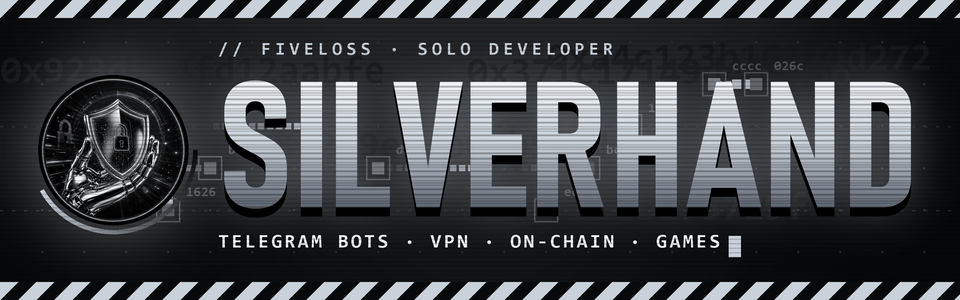
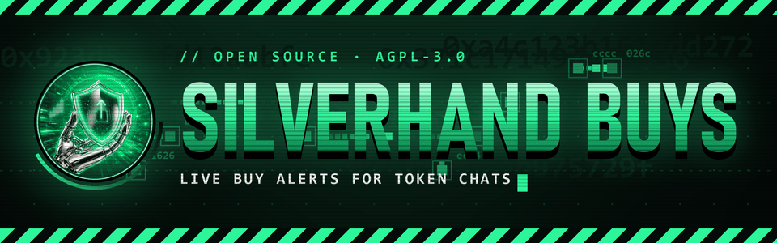
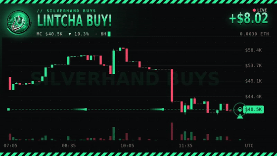
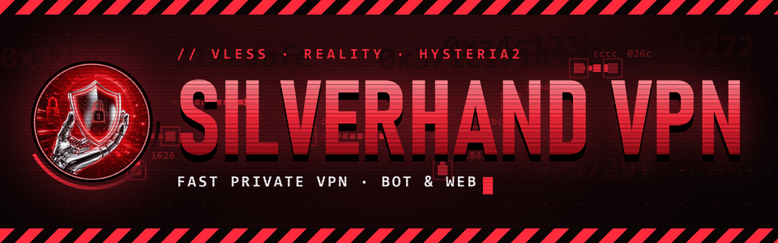
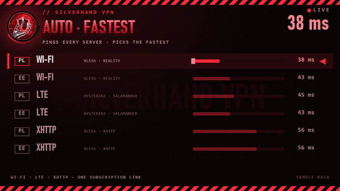
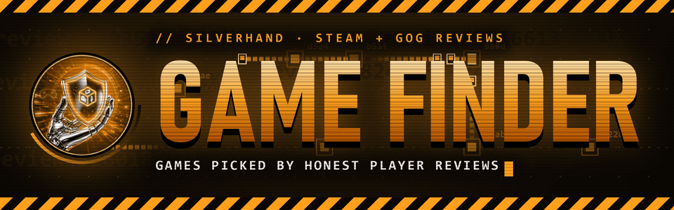
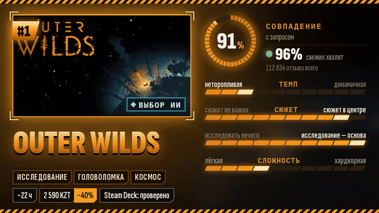

  

<h3 align="center">Telegram-first products, built and run solo, end to end</h3>

  
  
  

  
  
  
  
  
  
  
  
  

---

I build Telegram bots that people pay for, chat in and rely on: a buy bot that reads the
chain by hand, a VPN with its own shop and payments, and a game picker that reads player
reviews so you don't have to. Each project has its own animated look drawn in code, and
tests on the parts where a mistake costs money.

<table>
  <tr>
    <td width="33%" valign="top">
      <h4>⚡ <a href="#-silverhand-buys">Silverhand Buys</a></h4>
      Every buy of your token, live in your Telegram chat, with an animated market-cap chart.  
      <code>Robinhood Chain</code> <code>Uniswap v2–v4</code>  
      <a href="https://t.me/SilverhandBuysBot"><b>Add to chat</b></a> · <a href="https://github.com/Fiveloss/silverhand-buys">Source</a>
    </td>
    <td width="33%" valign="top">
      <h4>🔴 <a href="#-silverhand-vpn">Silverhand VPN</a></h4>
      A fast paid VPN you buy and manage in Telegram or on the web. One link, any app.  
      <code>VLESS Reality</code> <code>Hysteria2</code> <code>XHTTP</code>  
      <a href="https://t.me/fiveloss_VPNbot"><b>Open the bot</b></a> · <a href="https://quaynet.online">Website</a>
    </td>
    <td width="33%" valign="top">
      <h4>🎮 <a href="#-silverhand-game-finder">Game Finder</a></h4>
      Three games for right now, picked by what players honestly say in recent reviews.  
      <code>Steam + GOG</code> <code>free LLMs</code>  
      <a href="https://github.com/Fiveloss/silverhand-game-finder"><b>Source</b></a> · <a href="https://github.com/Fiveloss/silverhand-game-finder#self-hosting">Run your own</a>
    </td>
  </tr>
</table>

---

  

  
  
  
  

### ⚡ [Silverhand Buys](https://github.com/Fiveloss/silverhand-buys)

A Telegram buy bot for Robinhood Chain: add it to your token's group or channel and every buy lands in the chat the moment it hits the chain.

- 🎞 an animated market-cap card with every post
- 🆕 new holders, 💼 position changes, 🐋 whales, 👨‍💻 dev buys
- 🎓 Pons and Flap.sh curves, then any Uniswap v2 / v3 / v4 pool
- 🚀 posts of their own for new market-cap highs and a filling curve
- 📊 `/stats` and 🏆 `/top` right in the chat
- 🌐 English and Русский · forum topics · channels
- 🔒 reads only its own commands, never asks for keys

**[➕ Add to your chat](https://t.me/SilverhandBuysBot)** · **[📖 Source](https://github.com/Fiveloss/silverhand-buys)**

 

---

  

  
  

### 🔴 [Silverhand VPN](https://quaynet.online)

A paid VPN you buy and manage in Telegram or on the web. One link works in Happ, INCY, v2rayN and other apps.

- ⚡ **Auto · Fastest** picks the quickest server by itself
- 📶 Wi-Fi, LTE with Salamander, XHTTP for strict networks
- 🌍 Poland and Estonia · Russian sites skip the tunnel
- 🛡 ads cut on the servers, no browsing history kept
- 🩺 connection check and speed test built in
- 💳 card, SBP or crypto · 🎁 gifts · 🌐 Русский

**[🤖 Open the bot](https://t.me/fiveloss_VPNbot)** · **[🌐 quaynet.online](https://quaynet.online)**

 

---

  

  
  
  
  

### 🎮 [Silverhand Game Finder](https://github.com/Fiveloss/silverhand-game-finder)

A Telegram bot that picks a game to play right now. Say it in your own words, *"like Hollow Knight, but easier, for a couple of evenings"*, and get three cards with the reasons they fit.

- 💬 your words, a mood button, or *"just not a shooter"*
- 🔎 a passport per game: real genres, 12 feel axes, praise and complaints
- 😌 a complaint can count for it: *"too slow"* is a plus if you asked for calm
- 🟢 honest about certainty · recent reviews apart from all-time
- 💰 prices in your Steam region · 🎮 Steam Deck status
- 🧠 free Gemini and Groq, optional: runs on heuristics without keys
- 🪶 one process, SQLite, under 300 MB of RAM

**[📖 Source](https://github.com/Fiveloss/silverhand-game-finder)** · **[🚀 Run your own](https://github.com/Fiveloss/silverhand-game-finder#self-hosting)**

 

---

### 🛠 How it's built

| | Stack | The interesting part |
|---|---|---|
| ⚡ **Buys** | `Python` · `aiogram 3` · `SQLite` · `Pillow` · `ffmpeg` | No web3 library: logs, ABI and keccak are decoded by hand, and every chain fact is checked against mainnet before start. Prices come from the trade events themselves, so the public RPC gets a handful of calls every three seconds. |
| 🔴 **VPN** | `Python` · `aiogram 3` · `aiohttp` · `SQLite` · `Xray-core` · `Hysteria2` · `Caddy` | One process runs the bot, the web shop and the payment webhooks. Every payment is re-checked with the provider before a key is issued, and the subscription carries its own routing rules. |
| 🎮 **Game Finder** | `Python` · `aiogram 3` · `SQLite` · `Pillow` · `Gemini` · `Groq` | Review mining that keeps taste apart from quality: bugs and MTX are always a minus, *"too hard"* depends on what you asked for. Each free LLM does the one job it is best at within its quota. |

<b>Habits shared by all three</b>

 

- 🧪 offline tests for the places where a bug costs money or trust
- 🔁 idempotent by design: a payment, a buy post or a key is never issued twice
- 🎞 banners, cards and menu screens animated in code with Pillow and ffmpeg
- 🔒 secrets only in `.env`, and nothing stored that isn't needed
- 📦 one process, SQLite, systemd: cheap to host, easy to back up

 

Not paper hands. Silver hands.

